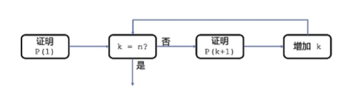

# 第1章：递归函数设计技巧
--- 
## 📖 递归函数的设计技巧


>### 拿起武器：数学归纳法
#### 🌟根据数学归纳法的思维（a.k.a 程序归纳法）证明程序的正确性，随着程序复杂度增高，这种思维方式越重要。
-  $P(1) \& P(k) \rarr P(k+1)$, then $P(1) \rarr P(n)$

- $证明: 1 + 3 + ... + (2n+1)= n^2$
    1. $P(1) = 1 = 1^2$
    2. $(n-1)^2 = 2n-1 = n^2 \larr Expand\&Cancel$
    3. 1和2结合证明成功
>### 递归函数设计的三个重要部分
1. #### 给「递归函数」一个明确的语意 🌟
    - 假设initialize一个f函数，那么就需要确定f代表什么，需要给到一个**明确**的解释
2. #### 实现边界条件时的程序逻辑
    - 对应数学归纳法中的$P(1)$
3. #### 假设递归函数调用返回结果是正确的，实现本层函数逻辑
    - 对应$P(k) \rarr P(k+1)$
>### 学以致用：递归求阶乘
```python
def f(n): 
    # f(n)代表n！
    if n == 1:
        # 边界条件P(1)：n == 1
        return 1
    return f(n-1) * n # 利用f(n-1)的，计值算f(n)的值
```


<div style="width:200px">
<hr/> <span style="font-family:Papyrus; font-size:1em;">Notes By Wenqian Zhao</span>
</div>
